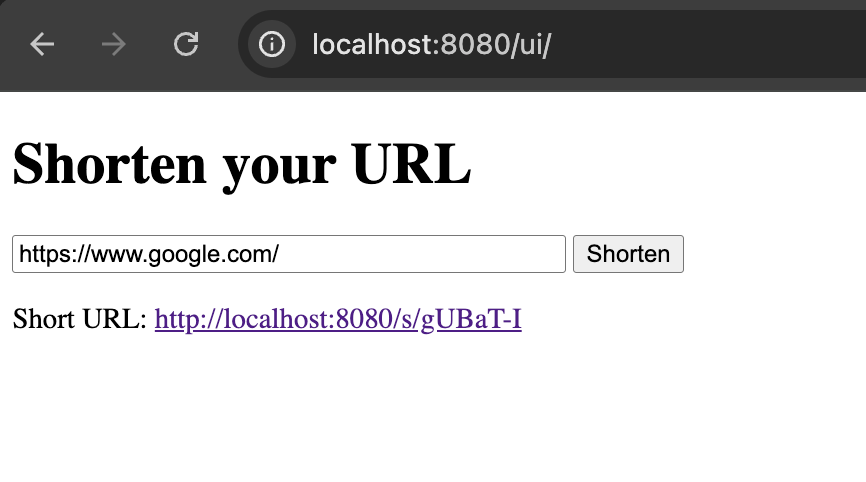
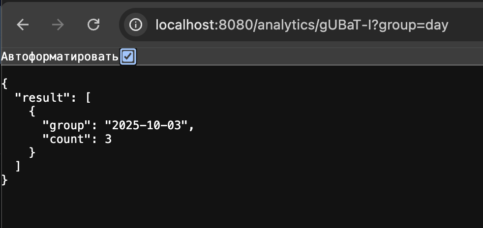
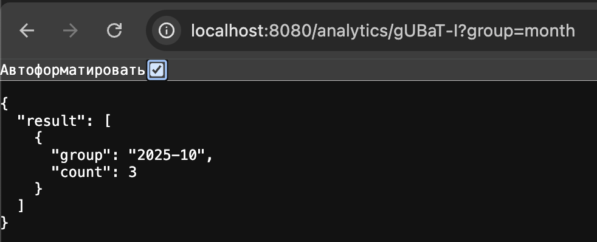
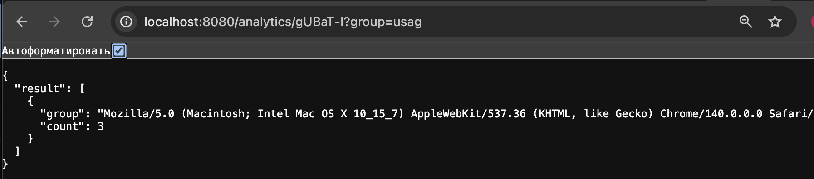

## Shortener 
сервис сокращения URL с аналитикой

### [Задание](./docs/task.md)

## Описание
`Shortener` — Shortener - это сервис сокращения URL, который позволяет пользователям создавать короткие ссылки, перенаправлять на оригинальные адреса и собирать подробную аналитику переходов. Сервис реализует хранение переходов, агрегацию статистики по дате и браузерам, HTTP API и простую CLI- или web-интеграцию.

---

## Технологии

- **Go** - основной язык разработки
- **PostgreSQL** — хранение ссылок и кликов
- **gin** — веб-фреймворк
- **Docker + Docker Compose** — контейнеризация и запуск окружения
- **HTML + JS** — простой UI для отправки и отслеживания уведомлений

---

## Функциональность

- API для работы с ссылками:
- `POST /shorten` — создать короткую ссылку
- `GET /s/:short_url` — перейти по короткой ссылке
- `GET /s/:short_url?group=day|month|usag` — получить аналитику (по дням, месяцам или User-Agent'ам)
- `GET /s/:short_url` (без параметров) — получить сырые клики

---

## Начало работы
### Установка
Клонирование репозитория
```sh
git clone https://github.com/ProgrammistNik/WB-L3/tree/main/l3.2_Shortener
```
### Запуск сервиса
Запускаем контейнер с помощью Makefile
```sh
make run
```
### Запуск тестов
Проверка vet, lint, data race,
```sh
make check
```

### Просмотр веб-интерфейса

**Основная страница:** [`http://localhost:8080/ui`](http://localhost:8080/ui)

Возможности:
- Создание короткой ссылки
- Переход по короткой ссылке 
- Получение аналитики по переходам

### Формат запросов
#### создание события
Заходим на основную веб-старницу, в ставляем в поле ссылку, 
нажимаем на кнопку `Shorten` генерируем короткую ссылку


---
Переходим по ссылке произвольное количество раз.
Теперь можно посмотреть аналитику 
---

### **Аналитика по дням**
Перейдем по ссылке `http://localhost:8080/analytics/<short_url>?group=day`


### **Аналитика по месяцам**
Перейдем по ссылке `http://localhost:8080/analytics/<short_url>?group=month`


### **Аналитика по User-Agent**
Перейдем по ссылке `http://localhost:8080/analytics/<short_url>?group=usag`


### **Аналитика общая**
Перейдем по ссылке `http://localhost:8080/analytics/<short_url>?`
