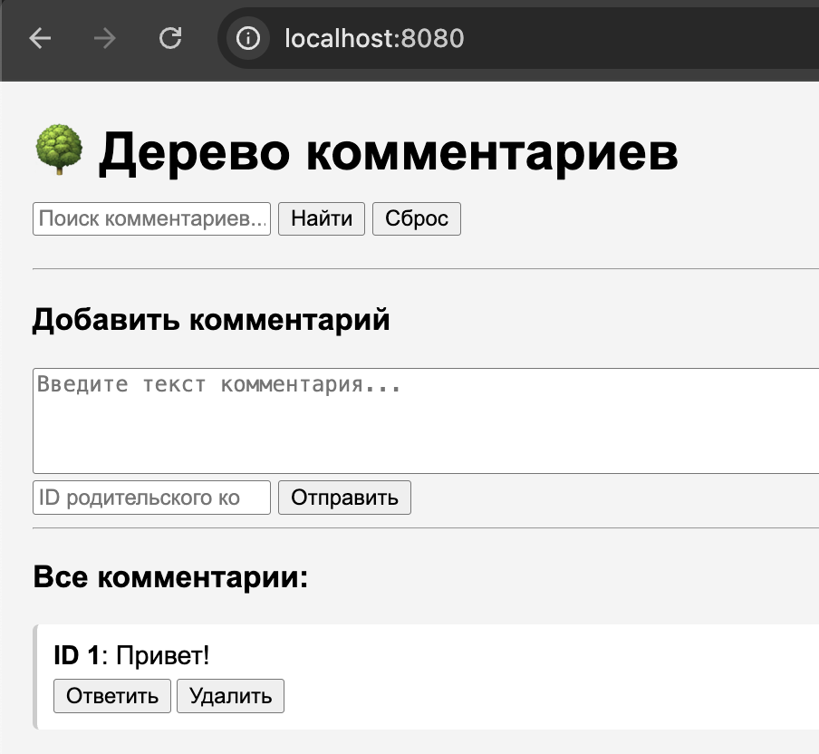
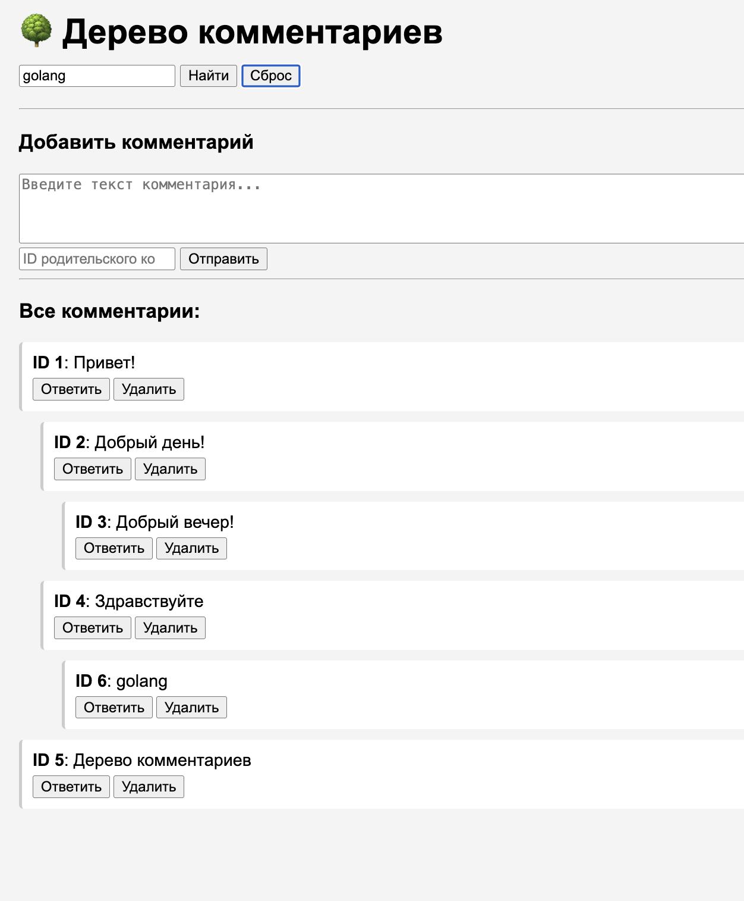
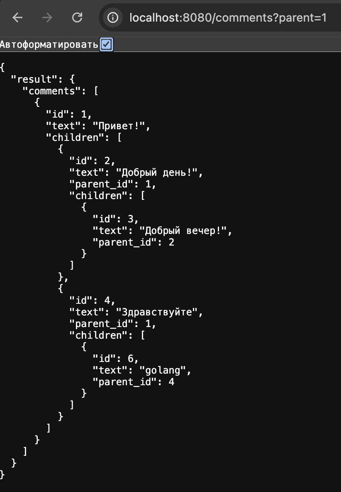
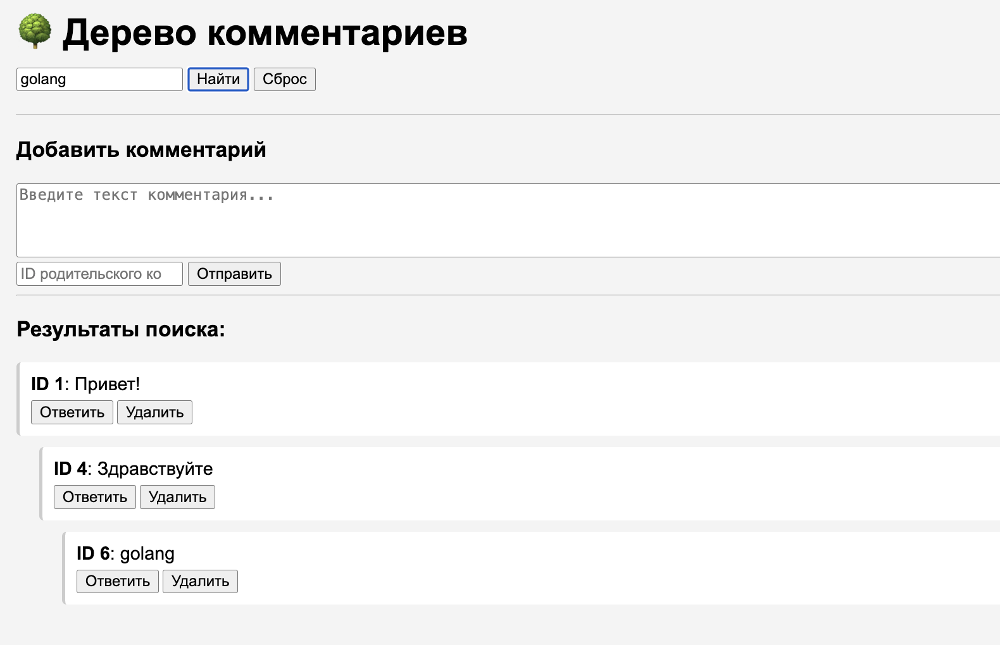
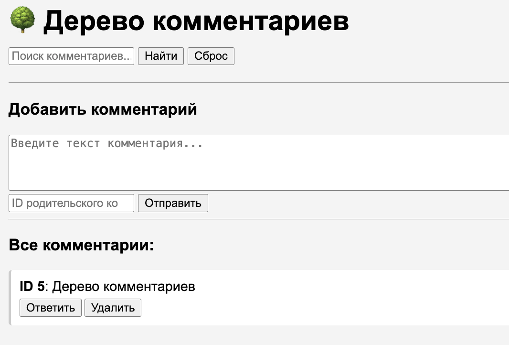

## CommentTree — древовидные комментарии с навигацией и поиском


### [Задание](./docs/task.md)

## Описание
`CommentTree` - это микросервис для работы с древовидной структурой
комментариев, поддерживающий неограниченную вложенность, удаление всей ветки,
поиском по ключевым словам, постраничную навигацию, простой веб-интерефейс.

---
## Технологии

- **Go** - основной язык разработки
- **PostgreSQL** — хранение ссылок и кликов
- **gin** — веб-фреймворк
- **Docker + Docker Compose** — контейнеризация и запуск окружения
- **HTML + JS** — простой UI для отправки и отслеживания уведомлений
---

## Функциональность
- API для работы:
- `POST /comments` — создать комментарий
- `GET /comments?parent={id}` — получение дерева комментариев от указанного `id`.
Без параметра - все дерево.
- `DELETE /comments/{id} ` - удаление комментария и всех вложенных под ним.

---

## Начало работы
### Установка
Клонирование репозитория
```sh
git clone https://github.com/ProgrammistNik/WB-L3/tree/main/l3.3_CommentTree
```
### Запуск сервиса
Запускаем контейнер с помощью Makefile
```sh
make run
```
### Запуск тестов
Проверка vet, lint, data race,
```sh
make check
```

### Просмотр веб-интерфейса

**Основная страница:** [`http://localhost:8080`](http://localhost:8080)

Возможности:
- Создание комментария
- Создание вложенного комментария 
- Удаления комментария
- Поиск комментария по тексту

### Формат запросов
Заходим на веб-страницу и в поле `Добавить комментарий` 
пишем комментарий и жмем отправить. После этого у нас появится комментарий с его ID.


Создадим комментарии с разной вложенностью. Чтобы ответить на комментарий с ID 1 - достаточно нажать на нкопку `ответить` под комментарием 
и в поле `Добавить комментарий` написать ответ и отправить его. 

Как видим, комментарий с ID 3 вложен в комментарий с ID 2, тот в свою очередь, вложен в комментарий с ID 1.

Так же мы можем посмотреть все дерево с помощью `http://localhost:8080/comments?parent={id}`
Например:


Так же мы можем искать комментарии по тексту, который в них содержиться. Для этого 
в поле `поиск комментариев` введем ключевой текст и нажмем на кноку `найти`, внизу отобразиться 
результат поиска. Если резутат успешный, то отоброзится искомый комментарий и все его родители, все дерево,
чтобы было понятна цепочка и контекст.


Так же мы можем удалить комментарий и всех вложенных под ним. Для этого 
достаточно нажать на `Удалить` под нужным комментарием. Удалим комментарий с ID 1.
Как видим из картинки ниже, вместе с комментарием ID 1 были удалены все его дочерние комментарии.


