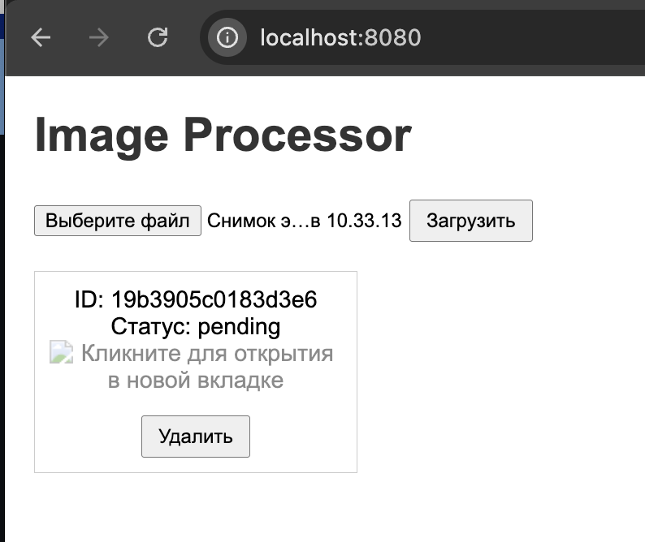
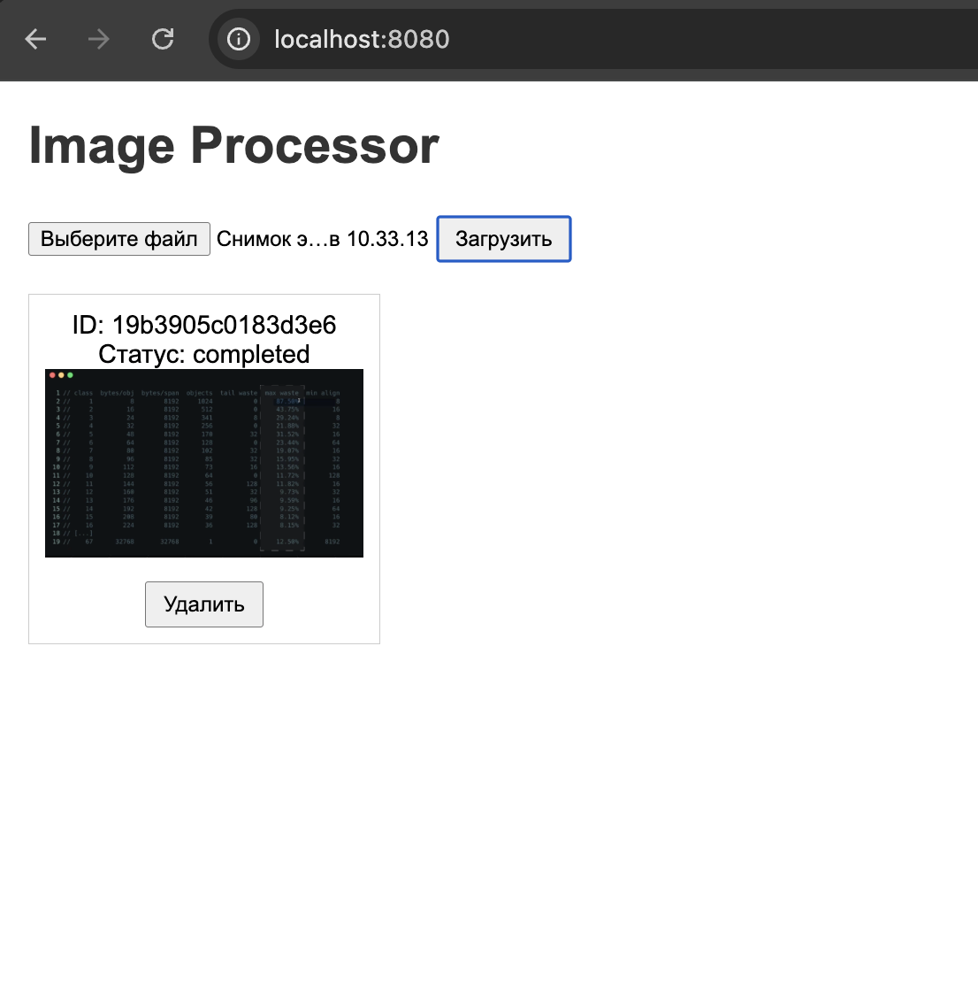
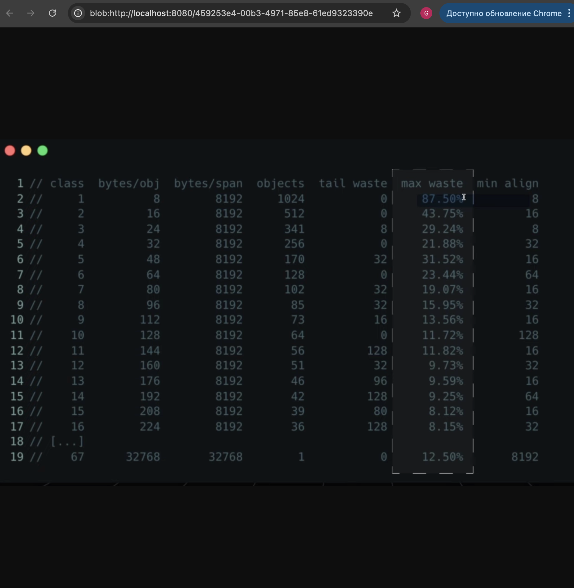
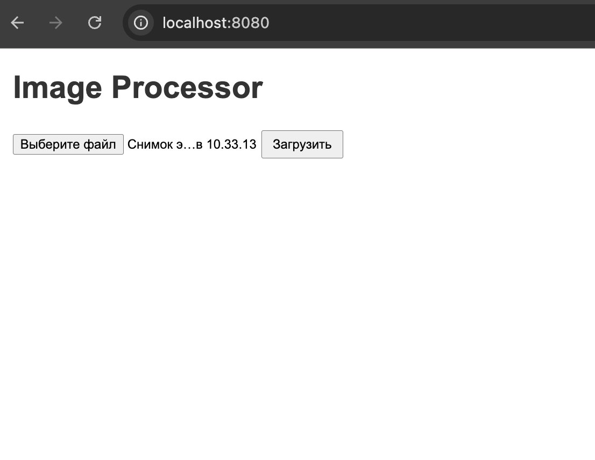

## ImageProcessor
Очередь фоновой обработки изображений

### [Задание](./docs/task.md)

## Описание

`image-processor` — ImageProcessor — сервис, который принимает загруженные пользователями изображения, ставит задачи на обработку в очередь (Kafka) и выполняет их в фоне. Обработка может включать ресайз, генерацию миниатюр, наложение водяных знаков. Такой подход позволяет не блокировать пользователей и обрабатывать изображения параллельно, масштабируемо и надежно.

---

## Технологии
- **Go** — основной язык разработки
- **Apache Kafka** — очередь для фоновой обработки изображений
- **gin** — веб-фреймворк
- **Docker + Docker Compose** — контейнеризация и запуск окружения
- **HTML + JS** — простой веб-интерфейс для загрузки, проверки и удаления изображений

---

## Функциональность
- HTTP API для работы с изображениями:
    - `POST /upload` — загрузка изображения на обработку
    - `GET /image/{id}` — получение обработанного изображения или его статуса
    - `DELETE /image/{id}` — удаление изображения

- Фоновая обработка изображений:
    - ресайз
    - генерация миниатюр
    - наложение водяных знаков

- Хранение исходных и обработанных изображений в файловой системе 
- Простой веб-интерфейс для загрузки, проверки и удаления изображений.

---

## Начало работы
### Установка
Клонирование репозитория
```sh
git clone https://github.com/ProgrammistNik/WB-L3/tree/main/l3.4_ImageProcessor
```
### Запуск сервиса
Запускаем контейнер с помощью Makefile
```sh
make start
```
После запуска сервиса автоматически создается директория `uploads` для хранения изображения на всех стадиях обработки и топик `images`

### Просмотр веб-интерфейса

**Основная страница:** [`http://localhost:8080/`](http://localhost:8080/)

- Возможности:
    - Загрузка изображения через форму
    - Отображение ID загруженного изображения и его статуса
    - Просмотр обработанного изображения после завершения обработки
    - Удаление изображения

## Пример использования

### Загрузка изображения

На странице нажимаем `Выбрать файл` и затем `Загрузить`.  
После загрузки получаем ответ с `id` изображения и статусом `"pending"`.
Загружать можно большое количество изображений.




### Отображение статуса

Пока изображение обрабатывается, статус `"processing"` или `"pending"` отображается на странице.  
После завершения обработки статус меняется на `"completed"` и появляется превью.



### Открытие изображения

Клик по превью открывает изображение в новой вкладке.  
Пока изображение обрабатывается, клик показывает уведомление:



### Удаление изображения

Нажав кнопку **"Удалить"**, изображение удаляется с сервера и исчезает с интерфейса.




### Просмотр очереди Kafka

Для мониторинга Kafka используется `Kafka UI` — удобный веб-интерфейс.

**Открыть Kafka UI:** [`http://localhost:8081`](http://localhost:8081)

Возможности интерфейса:

- Просмотр сообщений в очередях обработки
- Отслеживание статусов задач
- Мониторинг потребителей
- Просмотр всех топиков (в том числе `images`)
- Просмотр сообщений, полученных сервисом
- Возможность отправки тестовых JSON-сообщений напрямую в топик