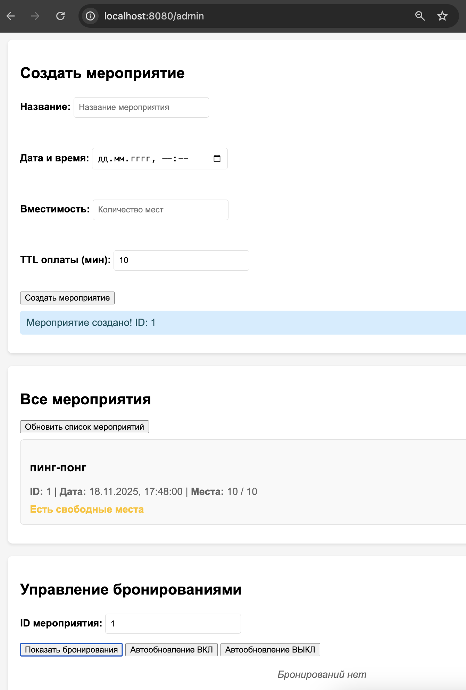
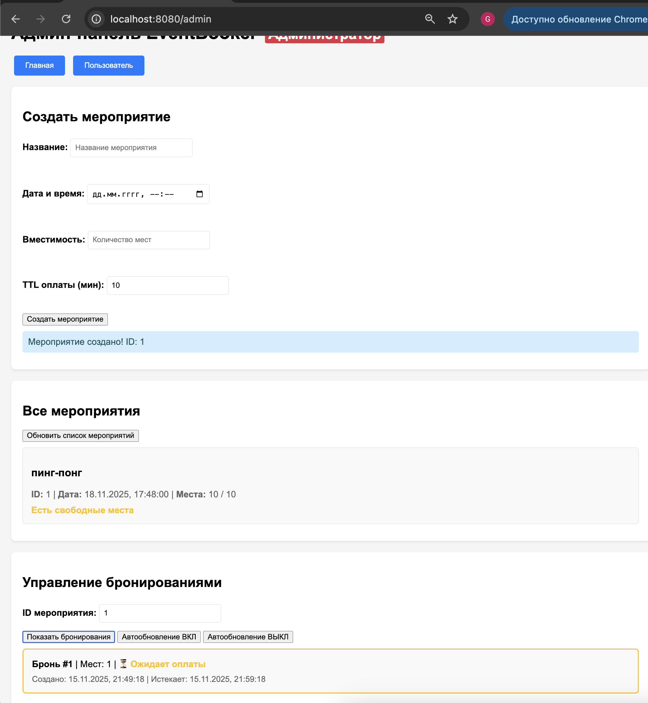
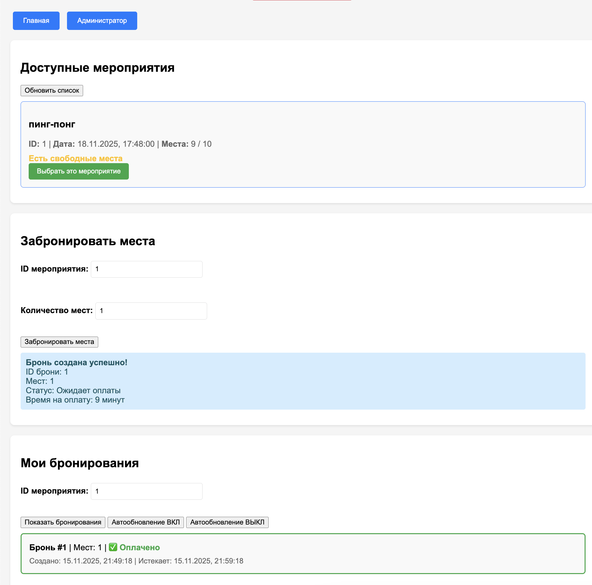
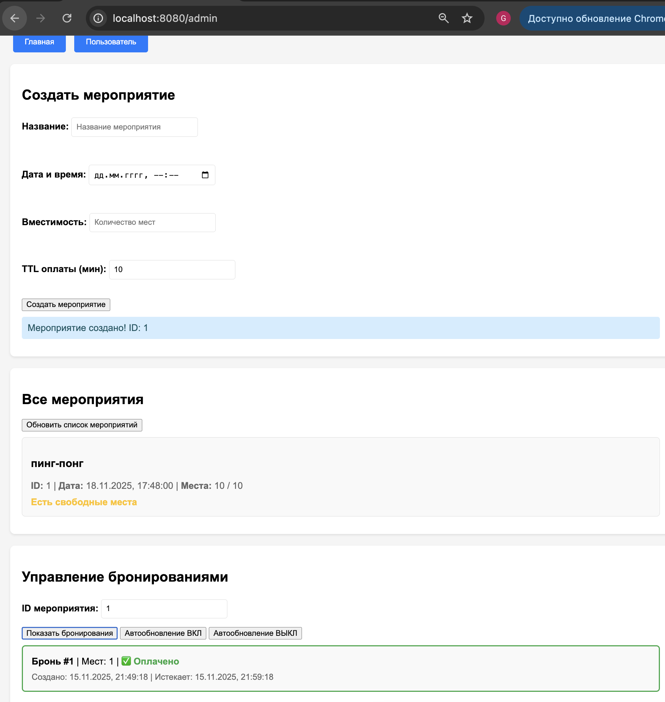
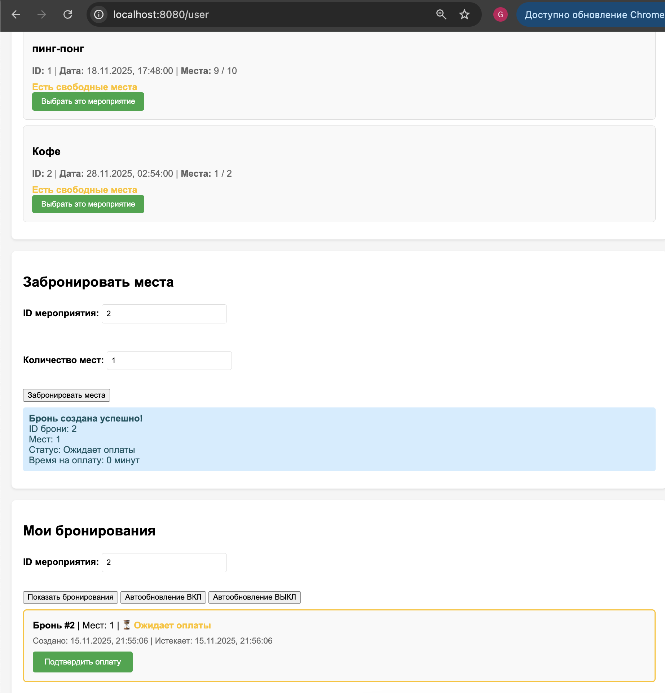
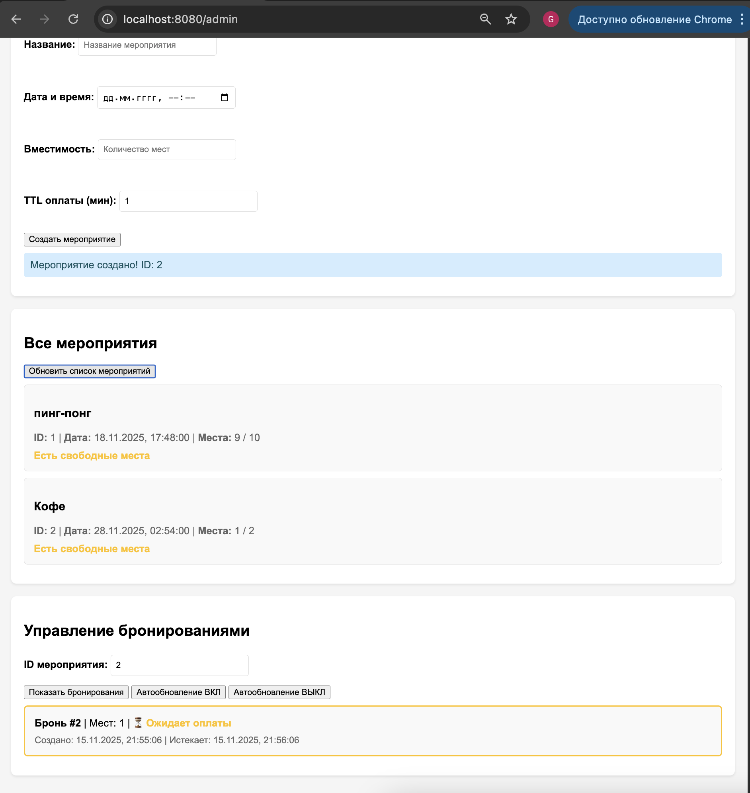
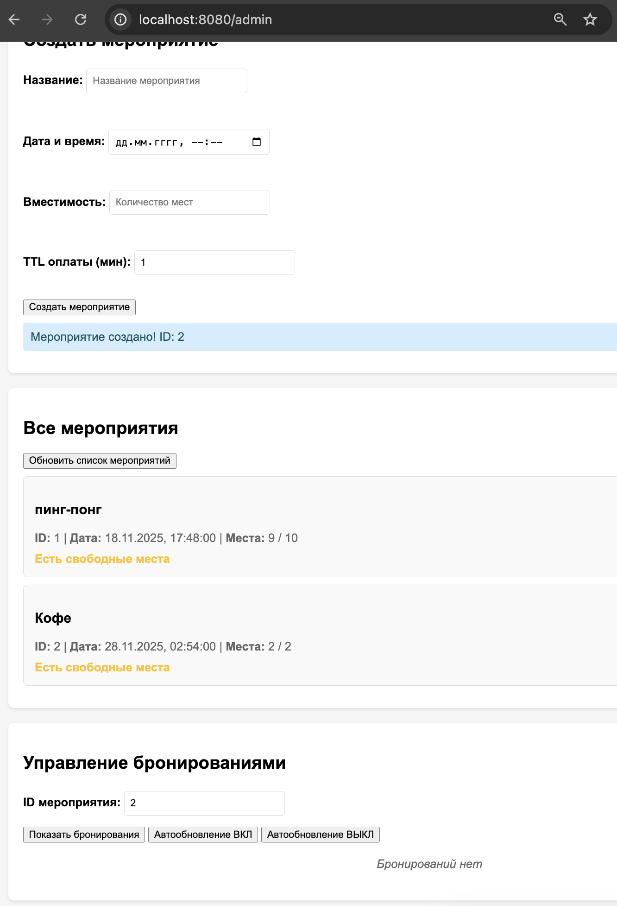

## EventBooker
Сервис бронирования с дедлайнами

### [Задание](./docs/task.md)

## Описание

`event-booker` — EventBooker — сервис для создания мероприятий, бронирования мест и автоматической отмены неоплаченных броней,
мини-система регистрации с дедлайнами оплаты.

Главная особенность сервиса — автоматическая отмена неоплаченных броней, если пользователь не подтверждает бронь в течение заданного времени. Это позволяет избежать «замороженных» мест и обеспечивает корректное распределение ресурсов.

Фоновый обработчик регулярно проверяет неоплаченные бронирования и удаляет просроченные, используя очередь или планировщик (cron-like scheduler). Все операции с данными выполняются безопасно, через транзакции, чтобы избежать гонок

---

## Технологии
- **Go** — основной язык разработки
- **PostgreSQL** — хранение данных о мероприятиях и бронях
- **gin** — веб-фреймворк
- **Docker + Docker Compose** — контейнеризация и запуск окружения
- **HTML + JS** — простой веб-интерфейс для пользователя и администратора

---

## Функциональность
- HTTP API для работы с мероприятиями и бронированиями:
    - `POST /events`— создание нового мероприятия
    - `POST /events/{id}/book` — бронирование места
    - `POST /events/{id}/confirm` — подтверждение / оплата брони
    - `GET /events/{id}` — получение информации о мероприятии:
        - общее количество мест
        - свободные места
        - активные/подтвержденные брони

---
## Логика бронирования

- Каждая бронь имеет срок жизни (например, 10 минут).
- Если бронь не подтверждена до истечения времени — она автоматически отменяется.
- Процесс отмены выполняется фоновым планировщиком:
    - проверяет все неоплаченные брони
    - сравнивает время создания
    - удаляет просроченные

### Фоновая обработка:
- автоматическое удаление неоплаченных броней  
- сравнение `expiresAt` с текущим временем  
- освобождение занятых мест  
- работа раз в минуту (interval 1m)  

### Веб-интерфейс:
**Пользовательская страница:**
- список мероприятий  
- создание брони  
- подтверждение брони  
- наблюдение исчезновения просроченных броней  

**Администраторская страница:**
- создание мероприятий (название, дата, кол-во мест, TTL оплаты)  
- просмотр активных и подтверждённых броней  
- мониторинг свободных мест 

## Начало работы
### Установка
Клонирование репозитория
```sh
git clone https://github.com/ProgrammistNik/WB-L3/tree/main/l3.5_EventBooker
```
### Запуск сервиса
Запускаем контейнер с помощью Makefile
```sh
make run
```

### Просмотр веб-интерфейса

**Основная страница:** [`http://localhost:8080/`](http://localhost:8080/)
стартовая страница для следующего перехода на страницы:
- `адиминистратора`[`http://localhost:8080/admin/`](http://localhost:8080/admin/) 
- `пользователя` [`http://localhost:8080/user/`](http://localhost:8080/user)

---

## Пример использования

### Создание мероприятия
Администратор задаёт: название мероприятия, дату, количество мест, TTL оплаты.  


### Бронирование
Пользователь выбирает событие и оставляет заявку.  
Статус брони: `"pending"`.


Отображение бронирования у администратор.



### Подтверждение
До истечения TTL пользователь может подтвердить (оплатить) бронь.  
Статус меняется на `"confirmed"`.



Отображение подтверждения оплаты у администратора.




### Автоматическая отмена
Если срок оплаты истёк, фоновый обработчик удаляет бронь, а место освобождается.
Вся информация о брони удаляется из БД.

Создадим событие, забронируем место и не оплатим в срок:
Подписываемся на событие




Не подтверждаем оплату и бронь исчезает, а забронированное место освобождается 2/2.


---
