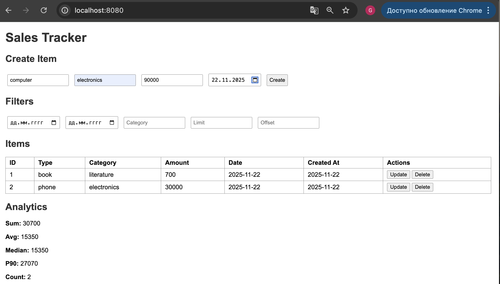
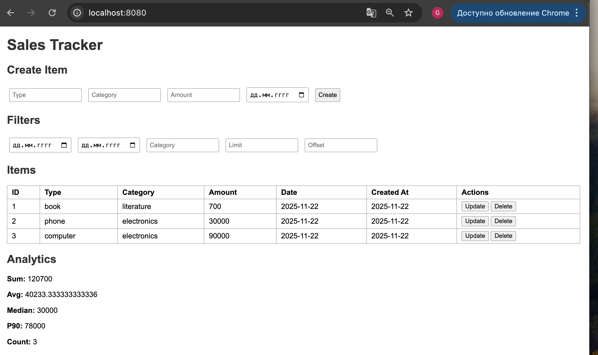
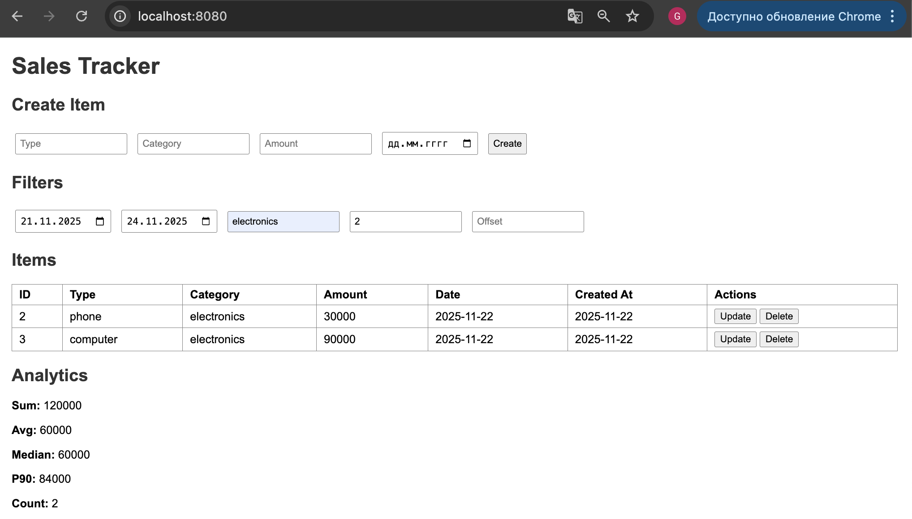
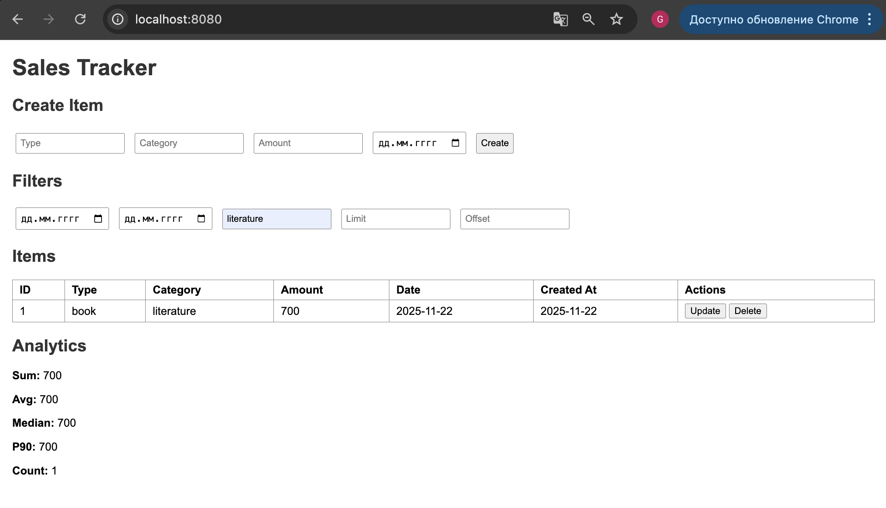
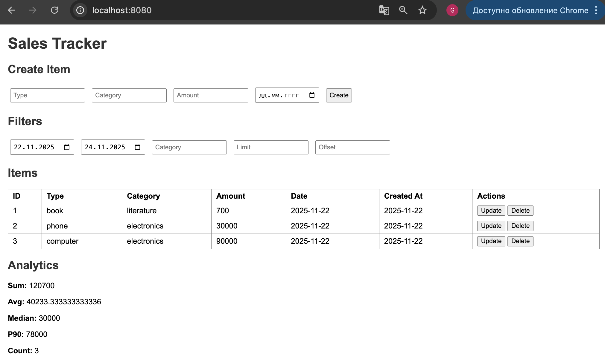
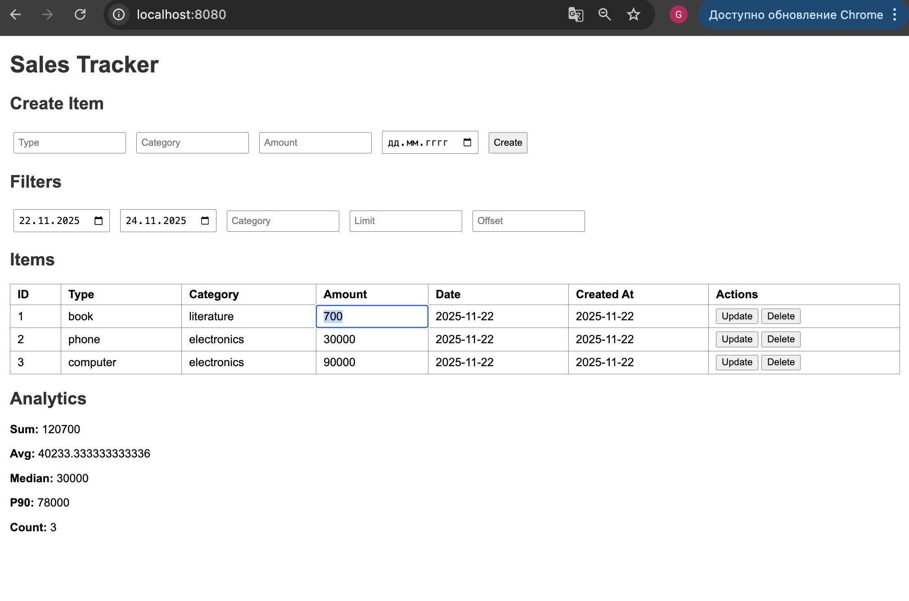
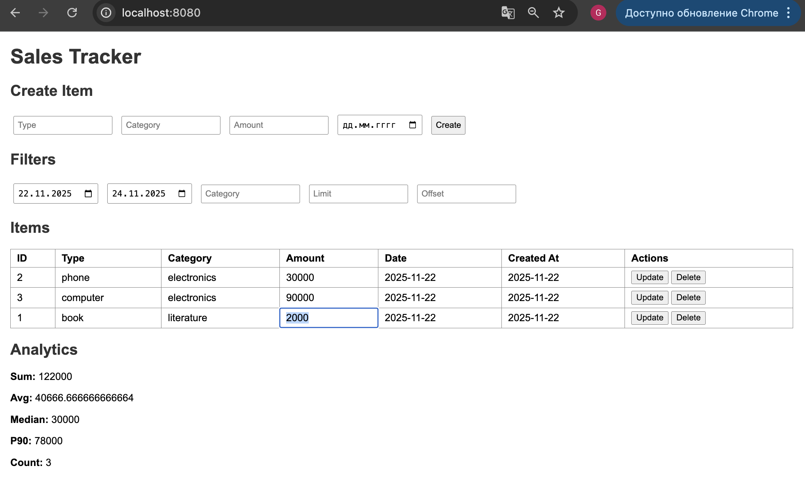
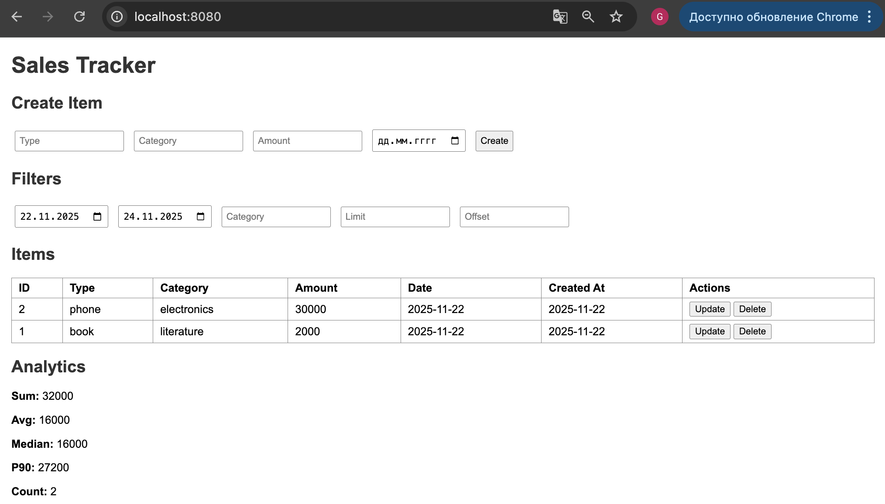

## SalesTracker
CRUD с аналитикой и агрегированием данных

### [Задание](./docs/task.md)

## Описание
`SalesTracker` — SalesTracker -  это сервис для хранения финансовых операций (продаж, расходов, транзакций) и получения аналитики по ним в реальном времени.

Главная особенность сервиса — возможность выполнять быстрые агрегированные запросы к данным: суммы, средние значения, количество записей, медианы, перцентили.
Сервис сочетает простое CRUD-хранилище и полноценный аналитический слой на SQL.

Все расчёты выполняются не в приложении, а на уровне PostgreSQL — через агрегации, оконные функции и фильтры.

---

## Технологии
- **Go** — основной язык разработки
- **PostgreSQL** — хранение данных о мероприятиях и бронях
- **gin** — веб-фреймворк
- **Docker + Docker Compose** — контейнеризация и запуск окружения
- **HTML + JS** — простой веб-интерфейс для пользователя и администратора

--- 

## Функциональность

CRUD Операции (/items):
- `POST /items` — создание записи
- `GET /items` — получение списка с фильтрами
- `PUT /items/{id}` — обновление (редактирование в таблице)
- `DELETE /items/{id}` — удаление

Поддерживаемые поля:
- type — тип транзакции (например: sale, refund)
- category — категория
- amount — сумма
- date — дата операции
- createdAt — время создания в БД

## Аналитика
Маршрут:

`GET /analytics?from=&to=&category=`

Возвращает:
- `sum` — сумма всех значений
- `avg`— среднее
- `count` — количество записей
- `median` — медиана 
- `p90` — 90-й перцентиль 

Так же вся аналитика доступна в веб-интерфейсе

### Веб-интерфейс:
Возможности:
- Создание записи
- Форма для ввода новой транзакции.

Автоматические фильтры при изменении любого поля фильтра:
- `from` / `to` / `category` / `limit` / `offset`

таблица и аналитика обновляются автоматически, без кнопок.

Таблица записей позволяет редактирование прямо в таблице (contenteditable)
- кнопка `Update` сохраняет изменения
- кнопка `Delete` удаляет строку

Аналитика представлена в виде колонки с:
- Суммой
- Средним
- Медианой
- 90-м перцентилем
- Количеством записей

## Начало работы
### Установка
Клонирование репозитория
```sh
git clone https://github.com/ProgrammistNik/WB-L3/tree/main/l3.6_SalesTracker
```
### Запуск сервиса
Запускаем контейнер с помощью Makefile
```sh
make run
```

### Просмотр веб-интерфейса
[`http://localhost:8080/`](http://localhost:8080/)

## Пример использования

### Создание записи: 
Пользователь заполняет форму и отправляет данные.
Запись мгновенно появляется в таблице, аналитика обновляется.
Создадим три записи. 

<p align="center">
    
</p>
<p align="center">
    
</p>


### Фильтрация

Задаём период from / to, категорию или limit/offset — таблица и аналитика изменяются автоматически.

Применим фильтр по категории товара, теперь отображаются только товары одной категории.
<p align="center">
    
</p>
<p align="center">
    
</p>
Применим фильтр по дате.
<p align="center">
    
</p>

Фильтры можно применять все сразу, так и отдельно. Аналитика пересчитывается под выбранные условия фильтрации.

### Редактирование

Поля строки становятся изменяемыми, после чего можно нажать Update.

Изменим поле `amount` для товара с ID `1`, вместо `700` укажим `2000`
<p align="center">
    
</p>

<p align="center">
    
</p>

Как видно, после обновления все данные по аналитике были пересчитаны согласно обновленным данным товара с ID `1`.
### Удаление

Кнопка Delete удаляет строку и обновляет аналитику.
Удалим товар с ID `3`.
<p align="center">
    
</p>
Как видно, после удаления товара с ID `3` все данные по аналитике были пересчитаны