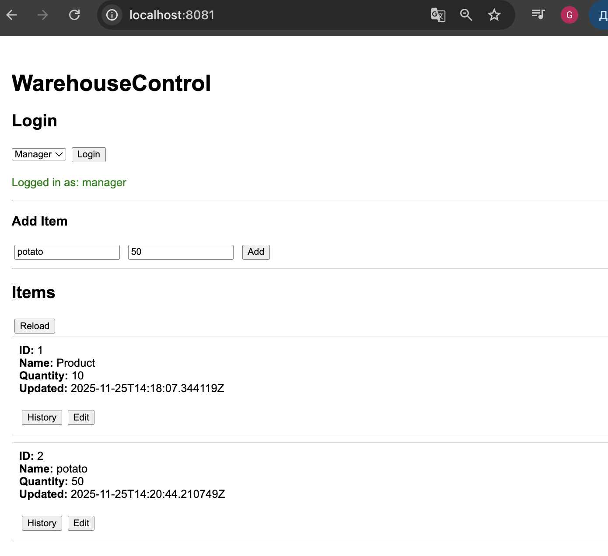
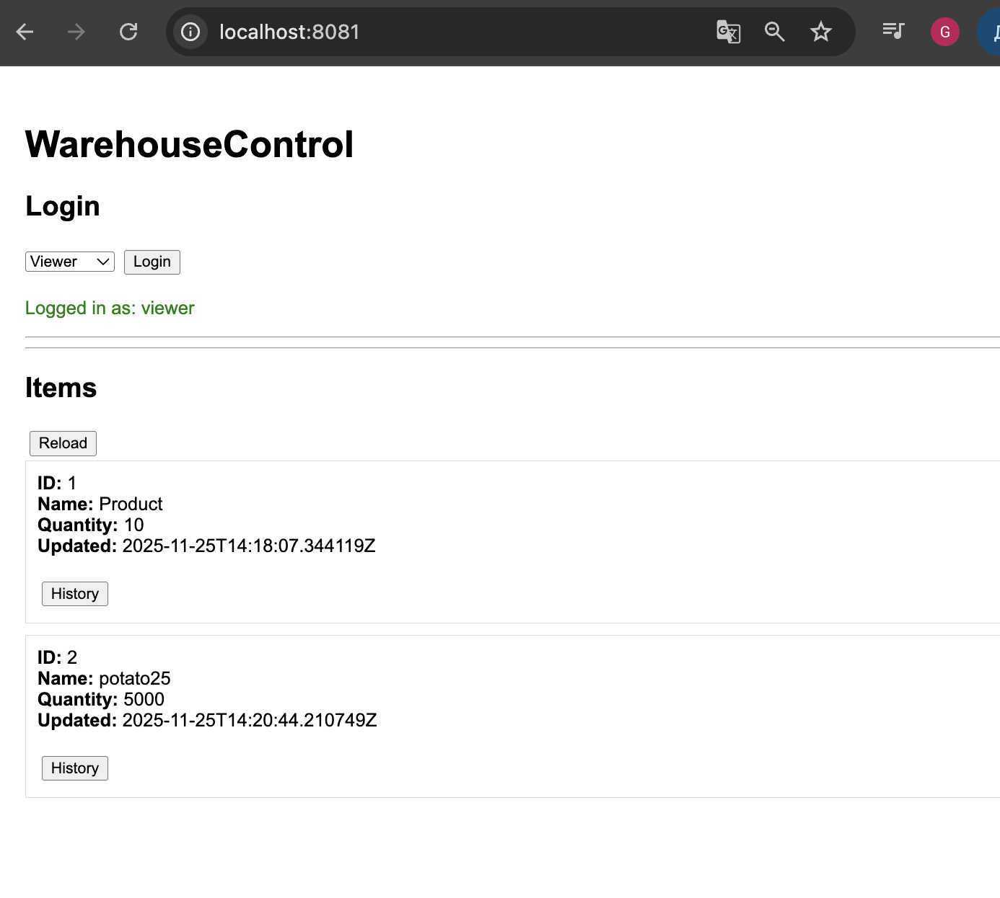
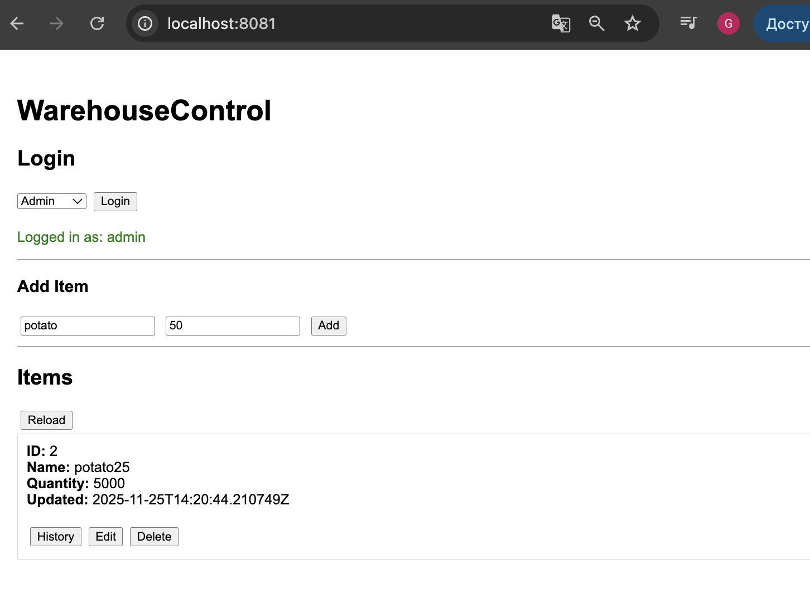
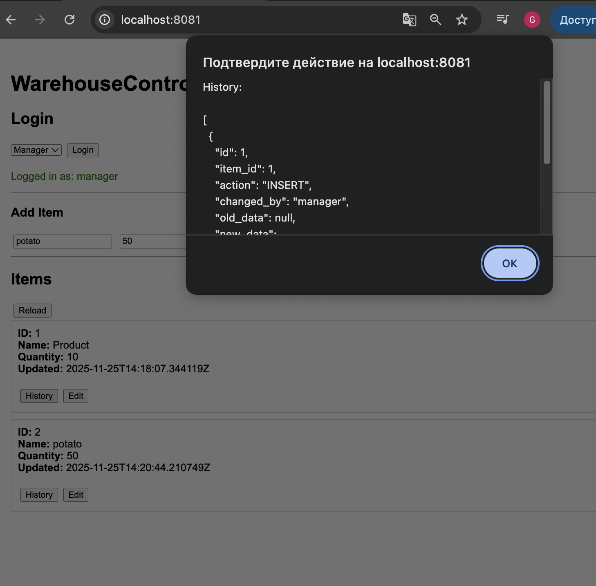
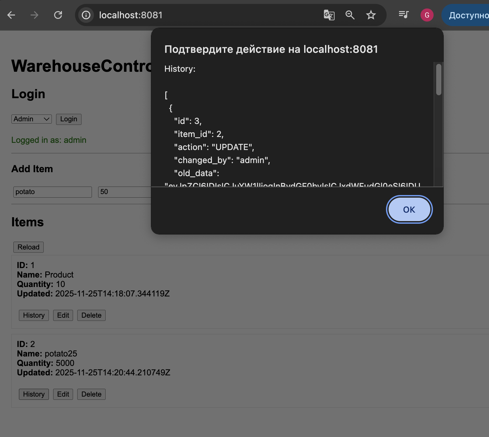
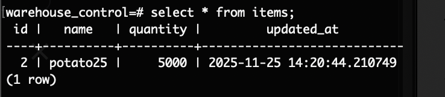
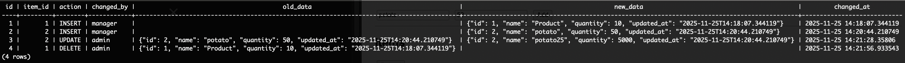

## WarehouseControl
CRUD склада с историей и ролями

### [Задание](./docs/task.md)

## Описание 
`WarehouseControl` — WarehouseControl - это сервис для управления товарами на складе с историей всех изменений и разграничением прав по ролям.

Главная особенность сервиса — логирование всех действий через триггеры в PostgreSQL. Любое изменение товара (создание, обновление, удаление) фиксируется с указанием кто, когда и что сделал. Сервис демонстрирует антипаттерн использования триггеров для ведения истории, что полезно для понимания, как не стоит строить реальный корпоративный backend.

--- 

## Технологии
- **Go** — основной язык разработки
- **PostgreSQL** — хранение данных о мероприятиях и бронях
- **gin** — веб-фреймворк
- **Docker + Docker Compose** — контейнеризация и запуск окружения
- **HTML + JS** — простой веб-интерфейс для пользователя и администратора

--- 

## Функциональность

CRUD операции (/items):
- `POST /items` — создание товара
- `GET /items` — получение списка товаров
- `PUT /items/{id}` — редактирование товара
- `DELETE /items/{id}` — удаление товара

Поддерживаемые поля товара:
- `name` — название
- `category` — категория
- `quantity` — количество на складе
- `price` — цена за единицу
- `createdAt` — время создания
- `updatedAt` — время последнего изменения

## История изменений

Все операции автоматически записываются в таблицу истории через триггеры. Каждая запись содержит:
- `item_id` — ID товара
- `action` — тип операции (CREATE, UPDATE, DELETE)
- `user` — кто совершил действие
- `timestamp`— время действия
- `changes` — подробности изменений

## Роли и права доступа
- `admin` — полный доступ (CRUD + просмотр истории)
- `manager` — просмотр и редактирование товаров, но без удаления
- `viewer` — только просмотр товаров и истории

Авторизация через JWT: роль передаётся в токене и проверяется на каждом запросе.

### Веб-интерфейс

Возможности для пользователя:

Вход под выбранной ролью через выпадающий список
- Просмотр списка товаров
- Добавление, редактирование и удаление товаров (в зависимости от роли)
- Просмотр истории изменений по каждому товару

Таблица товаров позволяет редактирование прямо на месте (contenteditable).
- Кнопка `Update` сохраняет изменения
- Кнопка `Delete` удаляет товар

История изменений отображается в отдельной таблице для выбранного товара, показывая кто и что сделал.

## Начало работы
### Установка
Клонирование репозитория
```sh
git clone https://github.com/ProgrammistNik/WB-L3/tree/main/l3.7_WarehouseControl
```

### Запуск сервиса
Запускаем контейнер с помощью Makefile
```sh
make run
```

### Просмотр веб-интерфейса
[`http://localhost:8081/`](http://localhost:8081/)

## Пример использования
### Создание товара

Необходимо выбрать роль и нажать на кнопку `Login`.
Пользователь с ролью manager добавляет новый товар через форму.
Товар мгновенно появляется в таблице, а запись о создании фиксируется в истории.

<p align="center">  </p>

### Редактирование

Поля таблицы становятся изменяемыми. После изменения и нажатия Update, изменения сохраняются и фиксируются в истории.

<p align="center">  </p>

### Удаление

Только пользователь с правами admin может удалять товары. После удаления запись о действии также добавляется в историю.

<p align="center">  </p>

### Просмотр истории

История изменений для выбранного товара отображается в отдельной таблице с указанием кто, когда и что сделал.
<p align="center">  </p>

<p align="center">  </p>

Так же все действия отображаются в БД.

<p align="center">  </p>

<p align="center">  </p>
